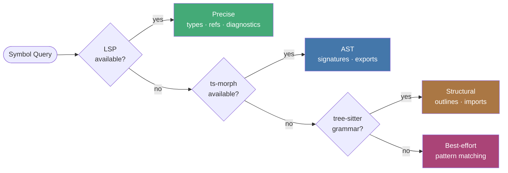
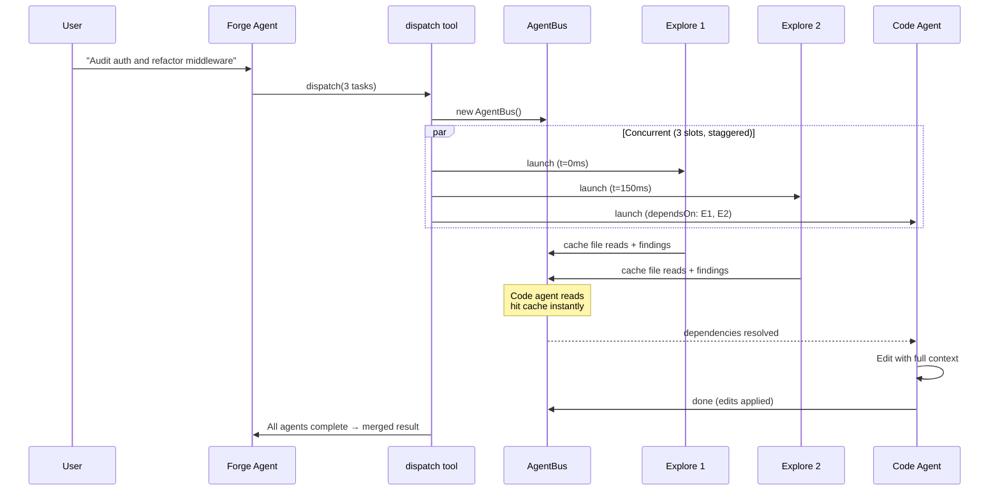
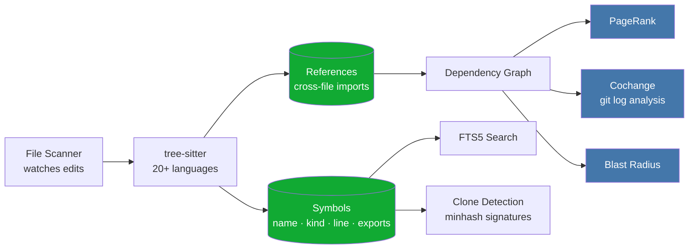
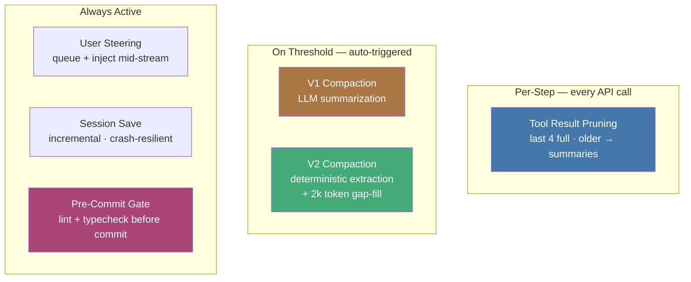

<h1 align="center">SoulForge</h1>

<p align="center">
  <strong>AI-Powered Terminal IDE</strong><br/>
  Embedded Neovim + Multi-Agent System + Graph-Powered Code Intelligence
</p>

<p align="center">
  <a href="LICENSE"></a>
  <a href="#"></a>
  <a href="https://www.typescriptlang.org/"></a>
  <a href="#testing"></a>
  <a href="https://bun.sh"></a>
</p>

<p align="center">
  <em>Built by <a href="https://github.com/proxysoul">proxySoul</a></em>
</p>

---

## What is SoulForge?

Your real Neovim — config, plugins, LSP — embedded in an AI agent that understands your codebase structurally. Graph-powered intelligence, multi-agent dispatch, 9 providers. Works over SSH.

<p align="center">
  
</p>

### How it compares

| | SoulForge | Claude Code | Copilot CLI | Aider |
|---|---|---|---|---|
| **Editor** | Embedded Neovim (your config) | No editor | No editor | No editor |
| **Code intelligence** | Graph + PageRank + blast radius + cochange + clone detection | File reads + grep | LSP (optional) | Tree-sitter repo map |
| **Multi-agent** | Parallel dispatch (8 agents, shared cache) | Subagents + Agent Teams | Explore agent | Single agent |
| **Providers** | 9 (Anthropic, OpenAI, Google, xAI, Ollama, +4) | Anthropic only | Multi-model | 100+ LLMs |
| **Cost visibility** | Per task, per agent, per model | `/cost` per session | Request counts | Per message |
| **MCP** | Roadmap | Yes | Yes | No |
| **License** | BSL 1.1 (source-available) | Open source | Open source | Apache 2.0 |

---

## Highlights

<table>
<tr>
<td width="50%">

### Real Neovim, Not Emulation
Your actual Neovim config, plugins, keybindings, and LSP — embedded via msgpack-RPC. The AI reads, navigates, and edits through the same editor you use. Treesitter highlighting, your colorscheme, your muscle memory.

</td>
<td width="50%">

### Multi-Agent Dispatch
Parallelize work across explore, code, and web search agents. Shared file cache prevents redundant reads. Edit coordination prevents conflicts. [Deep dive →](docs/agent-bus.md)

</td>
</tr>
<tr>
<td>

### Graph-Powered Repo Map
SQLite-backed codebase graph with PageRank ranking, cochange analysis, blast radius estimation, and clone detection. The agent understands which files matter, what changes together, and how far edits ripple — before reading a single line. [Deep dive →](docs/repo-map.md)

</td>
<td>

### 4-Tier Code Intelligence
LSP → ts-morph → tree-sitter → regex fallback chain. 20+ languages. The agent always has structural understanding, from compiler-precise to best-effort. [Deep dive →](docs/architecture.md)

</td>
</tr>
<tr>
<td>

### Compound Tools
`rename_symbol`, `move_symbol`, `refactor`, `project` do the complete job in one call. Compiler-guaranteed renames. Atomic moves with import updates. [Deep dive →](docs/compound-tools.md)

</td>
<td>

### Task Router + Cost Transparency
Assign models per task: Opus for planning, Sonnet for coding, Haiku for search. Token usage visible per task, per agent, per model — you see exactly what you're spending and the router optimizes it automatically.

</td>
</tr>
<tr>
<td>

### Context Management
Two-layer compaction keeps long sessions productive: rolling tool-result pruning per step, plus V1 (LLM summary) or V2 (deterministic extraction) compaction on threshold. [Deep dive →](docs/compaction.md)

</td>
<td>

### User Steering
Type messages while the agent is working — they queue up and inject into the next agent step. Steer without interrupting. Abort cleanly with Ctrl+X. [Deep dive →](docs/steering.md)

</td>
</tr>
<tr>
<td>

### Project Toolchain
Auto-detects lint, typecheck, test, and build commands across 16 ecosystems from config files. Pre-commit gate blocks `git commit` on lint/type errors. Monorepo package discovery. [Deep dive →](docs/project-tool.md)

</td>
<td>

### Any Model, Any Provider
9 providers — Anthropic, OpenAI, Google, xAI, Ollama (local), OpenRouter, and more. You own the API keys. No vendor lock-in. Automatic provider option degradation when features aren't supported. [Deep dive →](docs/provider-options.md)

</td>
</tr>
</table>

---

## Architecture

The Forge Agent is the orchestrator. It holds 30+ tools including the `dispatch` tool, which creates an AgentBus and launches parallel subagents. Subagents share file/tool caches through the bus and coordinate edits via ownership tracking.


### Intelligence Fallback Chain

Queries route through backends by tier. Each backend reports what it supports; the router picks the highest-tier backend available for the operation.



### Multi-Agent Dispatch

Up to 8 agents run concurrently (3 parallel slots) with staggered starts. All agents share a file cache through AgentBus — when one agent reads a file, others get it for free. Agents with `dependsOn` wait for their dependencies before starting.



---

## Installation

**Requirements:** [Bun](https://bun.sh) >= 1.0, [Neovim](https://neovim.io) >= 0.9

```bash
bun install -g @proxysoul/soulforge
soulforge   # or: sf
```

SoulForge checks for prerequisites on first launch and offers to install Neovim and Nerd Fonts if missing.

> Configure your `.npmrc` for GitHub Packages, or see [GETTING_STARTED.md](GETTING_STARTED.md) for detailed setup.

---

## Usage

### Keyboard Shortcuts

| Key | Action |
|-----|--------|
| `Ctrl+L` | Select LLM model |
| `Ctrl+E` | Toggle editor panel |
| `Ctrl+G` | Git menu |
| `Ctrl+S` | Skills browser |
| `Ctrl+K` | Command picker |
| `Ctrl+N` | New tab |
| `Ctrl+W` | Close tab |
| `Ctrl+X` | Abort current generation |
| `Tab` | Switch tabs |
| `Escape` | Toggle chat/editor focus |

### Slash Commands

| Command | Description |
|---------|-------------|
| `/model` | Switch model |
| `/router` | Per-task model routing |
| `/provider` | Thinking, effort, speed settings |
| `/mode` | Switch forge mode |
| `/git` | Git operations |
| `/compact` | Trigger context compaction |
| `/sessions` | Browse and restore sessions |
| `/setup` | Check and install prerequisites |

### Forge Modes

| Mode | Description |
|------|-------------|
| **default** | Full agent — reads and writes code |
| **architect** | Read-only design and architecture |
| **socratic** | Questions first, then suggestions |
| **challenge** | Adversarial review, finds flaws |
| **plan** | Research → structured plan → execute |

---

## Tool Suite

SoulForge ships 30+ tools organized by capability:

### Code Intelligence

| Tool | What it does |
|------|-------------|
| `read_code` | Extract function/class/type by name (LSP-powered) |
| `navigate` | Definition, references, call hierarchy, implementations |
| `analyze` | File diagnostics, unused symbols, complexity |
| `rename_symbol` | Compiler-guaranteed rename across all files |
| `move_symbol` | Move to another file + update all importers |
| `refactor` | Extract function/variable, organize imports |

### Codebase Analysis (zero LLM cost)

| Tool | What it does |
|------|-------------|
| `soul_grep` | Count-mode ripgrep with repo map intercept |
| `soul_find` | Fuzzy file/symbol search, PageRank-ranked |
| `soul_analyze` | Identifier frequency, unused exports, file profile |
| `soul_impact` | Dependency graph — dependents, cochanges, blast radius |

### Project Management

| Tool | What it does |
|------|-------------|
| `project` | Auto-detected lint, test, build, typecheck across [16 ecosystems](#project-toolchain-detection) |
| `project(list)` | Discover monorepo packages with per-package capabilities |
| `dispatch` | Parallel multi-agent execution (up to 8 agents, 3 concurrent) |
| `git` | Structured git operations with auto co-author tracking |

<details>
<summary><strong>All tools</strong></summary>

**Read/Write:** `read_file`, `edit_file`, `write_file`, `create_file`, `list_dir`, `glob`, `grep`

**Shell:** `shell` (with pre-commit lint gate, co-author injection, project tool redirect)

**Memory:** `memory_write`, `memory_search`, `memory_list`, `memory_delete`

**Agent:** `dispatch`, `web_search`, `fetch_page`

**Editor:** `editor` (Neovim integration — read, edit, navigate, diagnostics, format)

**Planning:** `plan`, `update_plan_step`, `task_list`, `ask_user`

</details>

---

## LLM Providers

| Provider | Models | Setup |
|----------|--------|-------|
| [**Anthropic**](https://console.anthropic.com/) | Claude 4.6 Opus/Sonnet, Haiku 4.5 | `ANTHROPIC_API_KEY` |
| [**OpenAI**](https://platform.openai.com/) | GPT-4.5, o3, o4-mini | `OPENAI_API_KEY` |
| [**Google**](https://aistudio.google.com/) | Gemini 2.5 Pro/Flash | `GOOGLE_GENERATIVE_AI_API_KEY` |
| [**xAI**](https://console.x.ai/) | Grok 3 | `XAI_API_KEY` |
| [**Ollama**](https://ollama.ai) | Any local model | Auto-detected |
| [**OpenRouter**](https://openrouter.ai) | 200+ models | `OPENROUTER_API_KEY` |
| [**LLM Gateway**](https://llmgateway.io) | Multi-model gateway (OpenAI, Claude, Gemini, DeepSeek) | `LLM_GATEWAY_API_KEY` |
| [**Vercel AI Gateway**](https://vercel.com/ai-gateway) | Unified gateway for 15+ providers with caching, fallbacks, rate limiting | `AI_GATEWAY_API_KEY` |
| [**Proxy**](https://github.com/router-for-me/CLIProxyAPI) | Local proxy with auto-lifecycle management — starts/stops with SoulForge | `PROXY_API_KEY` |

### Task Router

Assign different models to different jobs. Configure via `/router`:

| Slot | Default | Purpose |
|------|---------|---------|
| Planning | Sonnet | Architecture, design decisions |
| Coding | Opus | Implementation, bug fixes |
| Exploration | Opus | Research, code reading |
| Web Search | Haiku | Search queries |
| Trivial | Haiku | Small, simple tasks (auto-detected) |
| De-sloppify | Haiku | Post-implementation cleanup pass |
| Compact | Haiku | Context compaction summaries |

---

## Repo Map

SQLite-backed graph of your entire codebase, updated in real-time as files are edited.



**Powers:** `soul_find` (PageRank-ranked search), `soul_grep` (zero-cost identifier counts), `soul_analyze` (unused exports, file profiles), `soul_impact` (blast radius, dependency chains), dispatch enrichment (auto-injects symbol line ranges), AST semantic summaries (docstrings for top 500 symbols).

[Full reference →](docs/repo-map.md)

---

## Context Management



- **Tool result pruning** — older tool results become one-line summaries enriched with repo map symbols
- **V1 compaction** — full LLM summarization when context exceeds threshold
- **V2 compaction** — deterministic state extraction from tool calls, cheap LLM gap-fill
- **User steering** — type while the agent works, messages inject at the next step
- **Pre-commit gate** — auto-runs native lint + typecheck before allowing `git commit`

[Compaction deep dive →](docs/compaction.md) · [Steering deep dive →](docs/steering.md)

---

## Project Toolchain Detection

The `project` tool auto-detects your toolchain from config files — no setup required:

| Ecosystem | Lint | Typecheck | Test | Build |
|-----------|------|-----------|------|-------|
| **JS/TS (Bun)** | biome / oxlint / eslint | tsc | bun test | bun run build |
| **JS/TS (Node)** | biome / oxlint / eslint | tsc | npm test | npm run build |
| **Deno** | deno lint | deno check | deno test | — |
| **Rust** | cargo clippy | cargo check | cargo test | cargo build |
| **Go** | golangci-lint / go vet | go build | go test | go build |
| **Python** | ruff / flake8 | pyright / mypy | pytest | — |
| **PHP** | phpstan / psalm | phpstan / psalm | phpunit | — |
| **Ruby** | rubocop | — | rspec / rails test | — |
| **Swift** | swiftlint | swift build | swift test | swift build |
| **Elixir** | credo | dialyzer | mix test | mix compile |
| **Java/Kotlin** | gradle check | javac / kotlinc | gradle test | gradle build |
| **C/C++** | clang-tidy | cmake build | ctest | cmake build |
| **Dart/Flutter** | dart analyze | dart analyze | flutter test | flutter build |
| **Zig** | — | zig build | zig build test | zig build |
| **Haskell** | hlint | stack build | stack test | stack build |
| **Scala** | — | sbt compile | sbt test | sbt compile |

**Monorepo support:** `project(action: "list")` discovers workspace packages across pnpm, npm/yarn, Cargo, and Go workspaces.

[Full reference →](docs/project-tool.md)

---

## Configuration

Layered config: global (`~/.soulforge/config.json`) + project (`.soulforge/config.json`).

```json
{
  "defaultModel": "anthropic/claude-sonnet-4-6",
  "thinking": { "mode": "adaptive" },
  "repoMap": true,
  "semanticSummaries": "ast",
  "diffStyle": "default",
  "chatStyle": "accent",
  "vimHints": true
}
```

See [GETTING_STARTED.md](GETTING_STARTED.md) for the full reference.

---

## Testing

```bash
bun test              # 1262 tests across 27 files
bun run typecheck     # tsc --noEmit
bun run lint          # biome check (lint + format)
bun run lint:fix      # auto-fix
```

---

## Documentation

| Document | Description |
|----------|-------------|
| **[Architecture](docs/architecture.md)** | System overview, data flow, component lifecycle |
| **[Repo Map](docs/repo-map.md)** | PageRank, cochange, blast radius, clone detection |
| **[Agent Bus](docs/agent-bus.md)** | Multi-agent coordination, shared cache, edit ownership |
| **[Compound Tools](docs/compound-tools.md)** | rename_symbol, move_symbol, refactor internals |
| **[Compaction](docs/compaction.md)** | V1/V2 context management strategies |
| **[Project Tool](docs/project-tool.md)** | Toolchain detection, pre-commit checks, monorepo discovery |
| **[Steering](docs/steering.md)** | Mid-stream user input injection |
| **[Provider Options](docs/provider-options.md)** | Thinking modes, context management, degradation |
| [Getting Started](GETTING_STARTED.md) | Installation, configuration, first steps |
| [Contributing](CONTRIBUTING.md) | Dev setup, project structure, PR guidelines |
| [Security](SECURITY.md) | Security policy, responsible disclosure |

---

## Roadmap

**In progress:**
- **MCP server support** — connect existing MCP tools (databases, APIs, custom servers) directly to SoulForge
- **Repo Map visualization** — interactive dependency graph, PageRank heatmap, blast radius explorer
- **GitHub CLI integration** — native `gh_pr`, `gh_issue`, `gh_status` tools with structured output
- **Dispatch worktrees** — git worktree per code agent for conflict-free parallel edits

**Planned:**
- **Benchmarks** — side-by-side comparisons: tool calls, edit accuracy, token efficiency on large codebases
- **Multi-tab coordination** — worktree isolation + shared awareness board across concurrent sessions
- **Orchestrated workflows** — sequential agent handoffs (planner → TDD → reviewer → security)

---

## Inspirations

SoulForge builds on ideas from projects we respect:

- **[Aider](https://github.com/Aider-AI/aider)** — pioneered tree-sitter repo maps with PageRank for AI code editing. SoulForge extends this with cochange analysis, blast radius, clone detection, and real-time graph updates on file edits.
- **[Everything Claude Code (ECC)](https://github.com/affaan-m/everything-claude-code)** — design philosophy: enforce behavior with code, not prompt instructions. Our `targetFiles` schema validation, pre-commit lint gates, confident tool output, and auto-enrichment patterns come from this thinking.
- **[Vercel AI SDK](https://sdk.vercel.ai)** — the multi-provider abstraction layer that makes 9 providers possible with a single tool loop interface.
- **[Neovim](https://neovim.io)** — the editor. SoulForge embeds it via msgpack-RPC rather than reimplementing it, because your config and muscle memory shouldn't be a compromise.

---

## License

[Business Source License 1.1](LICENSE). Free for personal and internal use. Commercial use requires a [commercial license](COMMERCIAL_LICENSE.md). Converts to Apache 2.0 on March 15, 2030. Third-party licenses in [THIRD_PARTY_LICENSES.md](THIRD_PARTY_LICENSES.md).

<p align="center">
  <sub>Built with care by <a href="https://github.com/proxysoul">proxySoul</a></sub>
</p>
