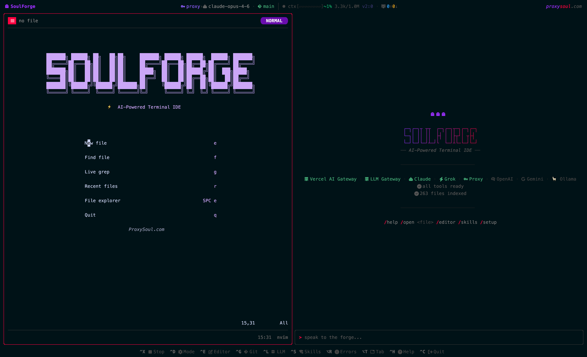
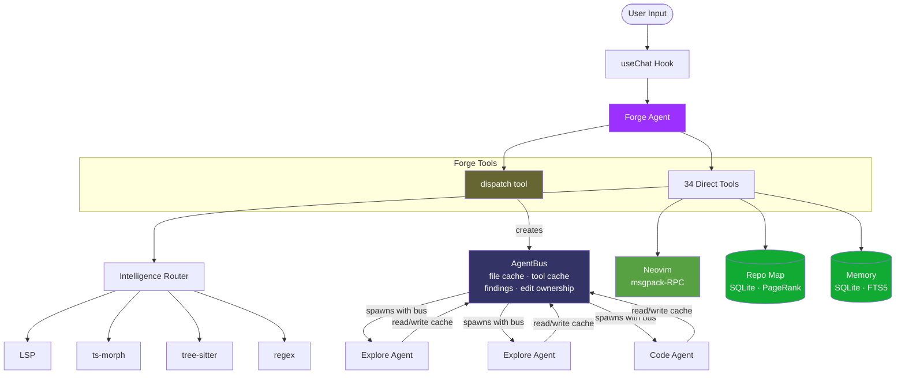
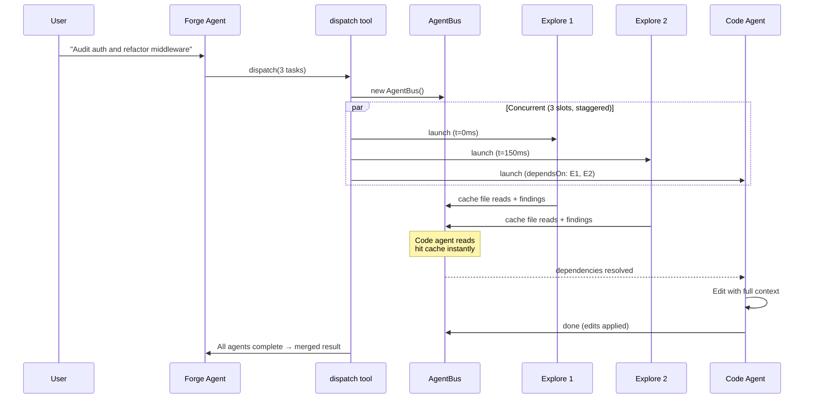
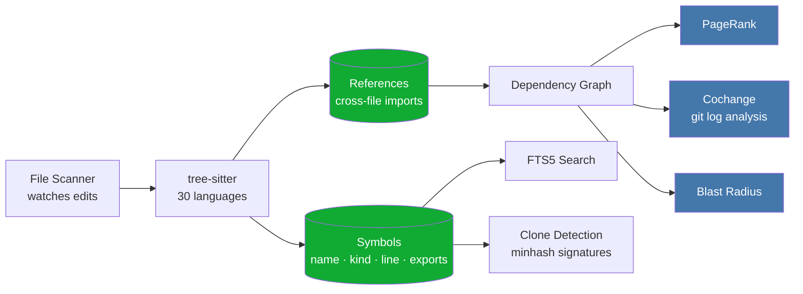
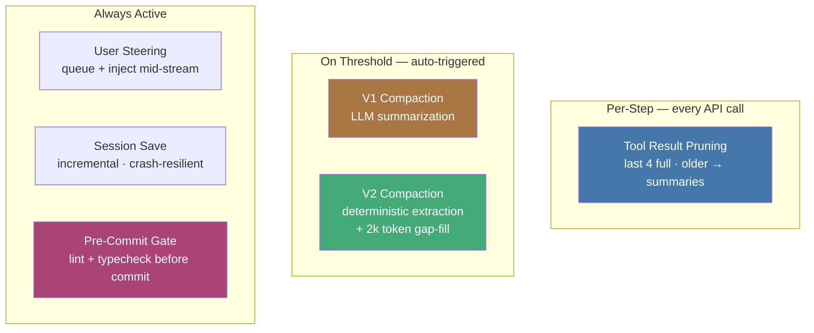

<h1 align="center">SoulForge</h1>

<p align="center">
  <strong>AI-Powered Terminal IDE</strong><br/>
  Embedded Neovim + Multi-Agent System + Graph-Powered Code Intelligence
</p>

<p align="center">
  <a href="LICENSE"></a>
  <a href="#"></a>
  <a href="https://www.typescriptlang.org/"></a>
  <a href="#testing"></a>
  <a href="https://bun.sh"></a>
</p>

<p align="center">
  <em>Built by <a href="https://github.com/proxysoul">proxySoul</a></em>
</p>

---

## What is SoulForge?

Your real Neovim — config, plugins, LSP — embedded in an AI agent that understands your codebase structurally. Graph-powered intelligence, multi-agent dispatch, 10 providers. Works over SSH.

<p align="center">
  
</p>

### How it compares

| | SoulForge | Claude Code | Copilot CLI | Codex CLI | Aider |
|---|---|---|---|---|---|
| **Editor** | Embedded Neovim (LazyVim, your config) | No editor | No editor | No editor | No editor |
| **Code graph** | SQLite graph — PageRank, blast radius, cochange, clone detection, FTS5 search, unused export detection, file profiles, identifier frequency | None (file reads + grep) | None | None (MCP plugins available) | Tree-sitter repo map + PageRank |
| **Code intelligence** | 4-tier fallback: LSP → ts-morph → tree-sitter → regex. Dual LSP (Neovim bridge + standalone). 30 languages | LSP via plugin marketplace (rename supported, no auto-install, no fallback chain) | LSP (VS Code engines) | MCP-based LSP via plugins | Tree-sitter AST |
| **Compound tools** | `rename_symbol`, `move_symbol`, `refactor` — compiler-guaranteed, atomic, cross-file | Rename via LSP | — | -- | — |
| **Semantic context** | AST summaries for top 500 symbols, dispatch auto-enrichment with symbol line ranges | — | — | -- | Tree-sitter tag summaries |
| **Multi-agent** | Parallel dispatch (8 agents, 3 concurrent, shared file cache, edit ownership) | Subagents + Agent Teams | Subagents + Fleet | Multi-agent v2 + subagents | Single agent |
| **Providers** | 10 (LLM Gateway, Anthropic, OpenAI, Google, xAI, Ollama, +4) | Anthropic models (API, Bedrock, Vertex) | Multi-model (Anthropic, OpenAI, Google) | OpenAI models | 100+ LLMs |
| **Task routing** | Per-task model assignment (plan, code, explore, search, trivial, cleanup, compact) | Single model | Single model | Per-agent model assignment | Single model |
| **Cost visibility** | Per task, per agent, per model | `/cost` per session | Request counts | Server-side tracking | Per message |
| **Context management** | 2-layer: per-step pruning + V1 (LLM summary) / V2 (deterministic extraction) compaction | Auto-compaction | Context window management | Server-side compaction | — |
| **MCP** | Roadmap | Yes | Yes | Yes | No |
| **License** | BSL 1.1 (source-available) | Proprietary | Proprietary | Apache 2.0 | Apache 2.0 |

> *Competitor features verified as of March 28, 2026. This landscape moves fast — [let us know](https://github.com/ProxySoul/soulforge/issues) if something's changed.*

---

## Highlights

<table>
<tr>
<td width="50%">

### Embedded Neovim + LazyVim
Your actual Neovim — LazyVim distribution with 30+ plugins, LSP servers auto-installed via Mason, Catppuccin theme, noice, lualine, treesitter highlighting. The AI reads, navigates, and edits through the same editor you use. Your config, your muscle memory.

</td>
<td width="50%">

### Multi-Agent Dispatch
Parallelize work across explore, code, and web search agents. Shared file cache prevents redundant reads. Edit coordination prevents conflicts. Up to 8 agents, 3 concurrent slots. [Deep dive →](docs/agent-bus.md)

</td>
</tr>
<tr>
<td>

### Graph-Powered Repo Map
SQLite-backed codebase graph with PageRank ranking, cochange analysis, blast radius estimation, and clone detection. The agent understands which files matter, what changes together, and how far edits ripple — before reading a single line. [Deep dive →](docs/repo-map.md)

</td>
<td>

### 4-Tier Code Intelligence
LSP → ts-morph → tree-sitter → regex fallback chain. 30 languages with convention-based visibility detection. Dual LSP backend: bridges to Neovim's LSP when the editor is open, spawns standalone servers when it's not. [Deep dive →](docs/architecture.md)

</td>
</tr>
<tr>
<td>

### Compound Tools
`rename_symbol`, `move_symbol`, `refactor`, `project` do the complete job in one call. Compiler-guaranteed renames. Atomic moves with import updates across all importers. [Deep dive →](docs/compound-tools.md)

</td>
<td>

### Task Router + Cost Transparency
Assign models per task: Opus for planning, Sonnet for coding, Haiku for search. Token usage visible per task, per agent, per model — you see exactly what you're spending and the router optimizes it automatically.

</td>
</tr>
<tr>
<td>

### Context Management
Two-layer compaction keeps long sessions productive: rolling tool-result pruning per step, plus V1 (LLM summary) or V2 (deterministic extraction) compaction on threshold. [Deep dive →](docs/compaction.md)

</td>
<td>

### User Steering
Type messages while the agent is working — they queue up and inject into the next agent step. Steer without interrupting. Abort cleanly with Ctrl+X. [Deep dive →](docs/steering.md)

</td>
</tr>
<tr>
<td>

### 10 Providers, Any Model
LLM Gateway, Anthropic, OpenAI, Google, xAI, Ollama (local), OpenRouter, Vercel AI Gateway, Proxy, and custom OpenAI-compatible APIs. You own the API keys. No vendor lock-in. [Deep dive →](docs/provider-options.md)

</td>
<td>

### Cross-Tab Coordination
Up to 5 concurrent tabs with per-tab model selection and advisory file claims. Run Opus in one tab for complex architecture, Haiku in another for quick searches. Agents see what other tabs are editing, get warnings on contested files, and git operations are blocked during active dispatch. [Deep dive →](docs/cross-tab-coordination.md)

</td>
</tr>
<tr>
<td>

### Project Toolchain
Auto-detects lint, typecheck, test, and build commands across 23 ecosystems from config files. Pre-commit gate blocks `git commit` on lint/type errors. Monorepo package discovery. [Deep dive →](docs/project-tool.md)

</td>
<td>

### Skills & Approval Gates
Installable skill system for domain-specific capabilities. Destructive action approval — `rm -rf`, `git push --force`, sensitive file edits individually prompted. Auto mode for full autonomy when you want it.

</td>
</tr>
</table>

---

## Architecture

The Forge Agent is the orchestrator. It holds 34 tools including the `dispatch` tool, which creates an AgentBus and launches parallel subagents. Subagents share file/tool caches through the bus and coordinate edits via ownership tracking.



### Intelligence Fallback Chain

Queries route through backends by tier. Each backend reports what it supports; the router picks the highest-tier backend available for the operation.


### Multi-Agent Dispatch

Up to 8 agents run concurrently (3 parallel slots) with staggered starts. All agents share a file cache through AgentBus — when one agent reads a file, others get it for free. Agents with `dependsOn` wait for their dependencies before starting.



---

## Installation

Pick the method that fits your workflow. SoulForge checks for prerequisites on first launch and offers to install Neovim and Nerd Fonts if missing.

### Prebuilt Binary (recommended)

Download the latest release for your platform — no runtime dependencies needed:

```bash
# macOS (Apple Silicon)
curl -fsSL https://github.com/ProxySoul/soulforge/releases/latest/download/soulforge-darwin-arm64.tar.gz | tar xz
sudo mv soulforge-darwin-arm64 /usr/local/bin/soulforge

# macOS (Intel)
curl -fsSL https://github.com/ProxySoul/soulforge/releases/latest/download/soulforge-darwin-x64.tar.gz | tar xz
sudo mv soulforge-darwin-x64 /usr/local/bin/soulforge

# Linux (x64)
curl -fsSL https://github.com/ProxySoul/soulforge/releases/latest/download/soulforge-linux-x64.tar.gz | tar xz
sudo mv soulforge-linux-x64 /usr/local/bin/soulforge

# Linux (ARM64)
curl -fsSL https://github.com/ProxySoul/soulforge/releases/latest/download/soulforge-linux-arm64.tar.gz | tar xz
sudo mv soulforge-linux-arm64 /usr/local/bin/soulforge
```

Then run `soulforge` (or `sf`).

<details>
<summary><strong>Homebrew</strong></summary>

```bash
brew tap proxysoul/tap
brew install soulforge
```

</details>

<details>
<summary><strong>npm / Bun (from GitHub Packages)</strong></summary>

Requires [Bun](https://bun.sh) >= 1.0 as the runtime.

```bash
# Configure GitHub Packages registry (one-time)
echo "@proxysoul:registry=https://npm.pkg.github.com" >> ~/.npmrc

# Install globally
bun install -g @proxysoul/soulforge
# or: npm install -g @proxysoul/soulforge

soulforge   # or: sf
```

</details>

<details>
<summary><strong>Self-contained bundle (includes Neovim, ripgrep, fd, lazygit)</strong></summary>

The bundle ships everything — Neovim 0.11, ripgrep, fd, lazygit, tree-sitter grammars, Nerd Font symbols, and a local LLM proxy. No system dependencies required. Build it from source:

```bash
git clone https://github.com/ProxySoul/soulforge.git
cd soulforge
bun install

# Build bundle (macOS ARM64 by default)
./scripts/bundle.sh              # → dist/bundle/soulforge-1.0.0-darwin-arm64/
./scripts/bundle.sh x64          # Intel Mac
./scripts/bundle.sh x64 linux    # Linux x64
./scripts/bundle.sh arm64 linux  # Linux ARM64

# Install
cd dist/bundle/soulforge-*/
./install.sh                     # installs to ~/.soulforge, adds to PATH

# Uninstall
~/.soulforge/uninstall.sh
```

</details>

<details>
<summary><strong>Build from source</strong></summary>

Requires [Bun](https://bun.sh) >= 1.0 and [Neovim](https://neovim.io) >= 0.11.

```bash
git clone https://github.com/ProxySoul/soulforge.git
cd soulforge
bun install

# Run in development mode
bun run dev

# Or build and link globally
bun run build
bun link
soulforge
```

</details>

### Quick start

```bash
soulforge                    # Launch — select a model with Ctrl+L
soulforge --set-key anthropic sk-ant-...   # Or save a key first
soulforge --list-providers   # Check which providers are ready
```

See [GETTING_STARTED.md](GETTING_STARTED.md) for a full walkthrough — first launch, model setup, editor configuration, and tips.

---

## Usage

### CLI Flags

```bash
soulforge                                    # Launch TUI
soulforge --session <id>                     # Resume a saved session
soulforge --headless "your prompt here"      # Stream to stdout
soulforge --headless --json "prompt"         # Structured JSON
soulforge --headless --events "prompt"       # JSONL event stream
soulforge --headless --model provider/model  # Override model
soulforge --headless --mode architect        # Read-only analysis
soulforge --headless --system "role" "prompt"# Inject system prompt
soulforge --headless --include file.ts       # Pre-load files
soulforge --headless --session <id> "prompt" # Resume session
soulforge --headless --save-session "prompt" # Save for later
soulforge --headless --max-steps 10          # Limit steps
soulforge --headless --timeout 60000         # Abort after 60s
soulforge --headless --no-repomap "prompt"   # Skip repo map
soulforge --headless --diff "fix the bug"    # Show changed files
soulforge --headless --no-render "prompt"    # Raw output (no ANSI styling)
soulforge --headless --chat                  # Interactive multi-turn chat
soulforge --headless --chat --events         # Chat with JSONL events
echo "prompt" | soulforge --headless         # Pipe from stdin
soulforge --list-providers                   # Provider status
soulforge --list-models [provider]           # Available models
soulforge --set-key <provider> <key>         # Save API key
soulforge --version                          # Version info
```

[Headless mode deep dive →](docs/headless.md)

### Keyboard Shortcuts

| Key | Action |
|-----|--------|
| `Ctrl+L` | Select LLM model |
| `Ctrl+E` | Toggle editor panel |
| `Ctrl+G` | Git menu |
| `Ctrl+S` | Skills browser |
| `Ctrl+K` | Command picker |
| `Ctrl+T` | New tab |
| `Ctrl+W` | Close tab |
| `Ctrl+X` | Abort current generation |
| `Tab` | Switch tabs |
| `Escape` | Toggle chat/editor focus |

### Slash Commands

85 commands available — press `/` or `Ctrl+K` to browse. Key ones by category:

**Models & Providers**
`/model` `/router` `/provider` `/model-scope`

**Agent & Modes**
`/mode` `/plan` `/agent-features` `/reasoning`

**Editor & Display**
`/editor` `/split` `/diff-style` `/chat-style` `/vim-hints` `/open <file>`

**Git** (all under `/git`)
`/git` `/git commit` `/git push` `/git pull` `/git branch` `/git log` `/git diff` `/git stash` `/git lazygit` `/git co-author`

**Intelligence & LSP**
`/lsp` `/lsp-install` `/lsp-restart` `/diagnose` `/repo-map` `/web-search` `/keys`

**Context & Memory**
`/compact` `/context` `/memory` `/compaction` `/instructions`

**Sessions & Tabs**
`/sessions` `/tab` `/tab new` `/tab close` `/tab rename` `/claim`

**Files & Changes**
`/changes` `/files` `/open <file>`

**System**
`/setup` `/skills` `/privacy` `/storage` `/errors` `/status` `/proxy`

[Full command reference →](docs/commands-reference.md)

### Forge Modes

| Mode | Description |
|------|-------------|
| **default** | Full agent — reads and writes code |
| **auto** | Full tool access, executes immediately, minimal questions |
| **architect** | Read-only design and architecture |
| **socratic** | Questions first, then suggestions |
| **challenge** | Adversarial review, finds flaws |
| **plan** | Research → structured plan → execute |

---

## Tool Suite

SoulForge ships 34 tools organized by capability:

### Code Intelligence

| Tool | What it does |
|------|-------------|
| `read_code` | Extract function/class/type by name (LSP-powered) |
| `navigate` | Definition, references, call hierarchy, implementations |
| `analyze` | File diagnostics, unused symbols, complexity |
| `rename_symbol` | Compiler-guaranteed rename across all files |
| `move_symbol` | Move to another file + update all importers |
| `refactor` | Extract function/variable, organize imports |

### Codebase Analysis (zero LLM cost)

| Tool | What it does |
|------|-------------|
| `soul_grep` | Count-mode ripgrep with repo map intercept |
| `soul_find` | Fuzzy file/symbol search, PageRank-ranked, signatures included |
| `soul_analyze` | Identifier frequency, unused exports, file profiles, top files by PageRank, external package usage, symbol lookup by kind/name with signatures |
| `soul_impact` | Dependency graph — dependents, cochanges, blast radius |

### Project Management

| Tool | What it does |
|------|-------------|
| `project` | Auto-detected lint, format, test, build, typecheck across [23 ecosystems](#project-toolchain-detection) |
| `project(list)` | Discover monorepo packages with per-package capabilities |
| `dispatch` | Parallel multi-agent execution (up to 8 agents, 3 concurrent) |
| `git` | Structured git operations with auto co-author tracking |

<details>
<summary><strong>All tools</strong></summary>

**Read/Write:** `read_file` (with `target` param for symbol extraction), `edit_file` (also handles create/write), `multi_edit`, `undo_edit`, `list_dir`, `glob`, `grep`

**Shell:** `shell` (with pre-commit lint gate, co-author injection, project tool redirect)

**Memory:** `memory` (actions: write, search, list, delete)

**Agent:** `dispatch`, `web_search`, `fetch_page`

**Editor:** `editor` (Neovim integration — read, edit, navigate, diagnostics, format)

**Planning:** `plan`, `update_plan_step`, `task_list`, `ask_user`

</details>

---

## LLM Providers

| Provider | Models | Setup |
|----------|--------|-------|
| [**LLM Gateway**](https://llmgateway.io) | Multi-model gateway (OpenAI, Claude, Gemini, DeepSeek) | `LLM_GATEWAY_API_KEY` |
| [**Anthropic**](https://console.anthropic.com/) | Claude 4.6 Opus/Sonnet, Haiku 4.5 | `ANTHROPIC_API_KEY` |
| [**OpenAI**](https://platform.openai.com/) | GPT-4.5, o3, o4-mini | `OPENAI_API_KEY` |
| [**Google**](https://aistudio.google.com/) | Gemini 2.5 Pro/Flash | `GOOGLE_GENERATIVE_AI_API_KEY` |
| [**xAI**](https://console.x.ai/) | Grok 3 | `XAI_API_KEY` |
| [**Ollama**](https://ollama.ai) | Any local model | Auto-detected |
| [**OpenRouter**](https://openrouter.ai) | 200+ models | `OPENROUTER_API_KEY` |
| [**Vercel AI Gateway**](https://vercel.com/ai-gateway) | Unified gateway for 15+ providers with caching, fallbacks, rate limiting | `AI_GATEWAY_API_KEY` |
| [**Proxy**](https://github.com/router-for-me/CLIProxyAPI) | Local proxy with auto-lifecycle management — starts/stops with SoulForge | `PROXY_API_KEY` |
| **Custom** | Any OpenAI-compatible API — add via config | Any env var |

### Custom Providers

Add any OpenAI-compatible API as a provider — no code changes needed:

```json
// ~/.soulforge/config.json (global) or .soulforge/config.json (project)
{
  "providers": [
    {
      "id": "deepseek",
      "name": "DeepSeek",
      "baseURL": "https://api.deepseek.com/v1",
      "envVar": "DEEPSEEK_API_KEY",
      "models": ["deepseek-chat", "deepseek-coder"],
      "modelsAPI": "https://api.deepseek.com/v1/models"
    }
  ]
}
```

Then use `deepseek/deepseek-chat` as a model ID anywhere — TUI model picker, headless `--model`, task router slots. Custom providers show `[custom]` in listings. If a custom `id` conflicts with a built-in, it auto-renames to `{id}-custom`.

[Custom providers reference →](docs/headless.md#custom-providers)

### Task Router

Assign different models to different jobs. Configure via `/router`:

| Slot | Default | Purpose |
|------|---------|---------|
| Planning | Sonnet | Architecture, design decisions |
| Coding | Opus | Implementation, bug fixes |
| Exploration | Opus | Research, code reading |
| Web Search | Haiku | Search queries |
| Trivial | Haiku | Small, simple tasks (auto-detected) |
| De-sloppify | Haiku | Post-implementation cleanup pass |
| Compact | Haiku | Context compaction summaries |

---

## Repo Map

SQLite-backed graph of your entire codebase, updated in real-time as files are edited.



**Powers:** `soul_find` (PageRank-ranked search with signatures), `soul_grep` (zero-cost identifier counts), `soul_analyze` (unused exports with dead code vs unnecessary export classification, file profiles, top files, external packages, symbol-by-kind queries with signatures), `soul_impact` (blast radius, dependency chains), dispatch enrichment (auto-injects symbol line ranges), AST semantic summaries (docstrings for top 500 symbols).

**Language support:** Convention-based visibility detection for 30 languages. Export inference via Go capitalization, Rust/Zig `pub`, Python/Dart underscore convention, Java/Kotlin/Swift/C#/Scala not-private, PHP, Elixir `def`/`defp`, C/C++/ObjC header files, Solidity, and more. Identifier extraction patterns cover camelCase, PascalCase, snake_case, and hyphenated (Elisp) naming conventions across all supported languages.

**Monorepo support:** Partial. The repo map indexes files within the working directory. Cross-package dependencies within a monorepo are not yet tracked — each package is treated as an independent unit. The `project` tool handles monorepo workspace discovery separately.

[Full reference →](docs/repo-map.md)

---

## Context Management



- **Tool result pruning** — older tool results become one-line summaries enriched with repo map symbols
- **V1 compaction** — full LLM summarization when context exceeds threshold
- **V2 compaction** — deterministic state extraction from tool calls, cheap LLM gap-fill
- **User steering** — type while the agent works, messages inject at the next step
- **Pre-commit gate** — auto-runs native lint + typecheck before allowing `git commit`

[Compaction deep dive →](docs/compaction.md) · [Steering deep dive →](docs/steering.md)

---

## Project Toolchain Detection

The `project` tool auto-detects your toolchain from config files — no setup required:

| Ecosystem | Lint | Typecheck | Test | Build |
|-----------|------|-----------|------|-------|
| **JS/TS (Bun)** | biome / oxlint / eslint | tsc | bun test | bun run build |
| **JS/TS (Node)** | biome / oxlint / eslint | tsc | npm test | npm run build |
| **Deno** | deno lint | deno check | deno test | — |
| **Rust** | cargo clippy | cargo check | cargo test | cargo build |
| **Go** | golangci-lint / go vet | go build | go test | go build |
| **Python** | ruff / flake8 | pyright / mypy | pytest | — |
| **PHP** | phpstan / psalm | phpstan / psalm | phpunit | — |
| **Ruby** | rubocop | — | rspec / rails test | — |
| **Swift** | swiftlint | swift build | swift test | swift build |
| **Elixir** | credo | dialyzer | mix test | mix compile |
| **Java/Kotlin** | gradle check | javac / kotlinc | gradle test | gradle build |
| **C/C++** | clang-tidy | cmake build | ctest | cmake build |
| **Dart/Flutter** | dart analyze | dart analyze | flutter test | flutter build |
| **Zig** | — | zig build | zig build test | zig build |
| **Haskell** | hlint | stack build | stack test | stack build |
| **Scala** | — | sbt compile | sbt test | sbt compile |
| **.NET/C#** | dotnet format | dotnet build | dotnet test | dotnet build |
| **iOS/Xcode** | swiftlint | xcodebuild build | xcodebuild test | xcodebuild build |
| **Java (Maven)** | checkstyle | mvn compile | mvn test | mvn package |
| **C/C++ (Make)** | — | — | make test | make |
| **Clojure** | clj-kondo | — | lein test / clj -M:test | lein uberjar |

**Monorepo support:** `project(action: "list")` discovers workspace packages across pnpm, npm/yarn, Cargo, and Go workspaces.

[Full reference →](docs/project-tool.md)

---

## Project Instructions

SoulForge loads `SOULFORGE.md` from your project root as project-specific instructions — conventions, architecture notes, toolchain preferences — injected into every prompt.

You can also load instruction files from other AI tools to reduce friction when migrating or working across tools:

| File | Source | Default |
|------|--------|---------|
| `SOULFORGE.md` | SoulForge | **on** |
| `CLAUDE.md` | Claude Code | off |
| `.cursorrules` | Cursor | off |
| `.github/copilot-instructions.md` | GitHub Copilot | off |
| `.clinerules` | Cline | off |
| `.windsurfrules` | Windsurf | off |
| `.aider.conf.yml` | Aider | off |
| `AGENTS.md` | OpenAI Codex | off |
| `.opencode/instructions.md` | OpenCode | off |
| `AMPLIFY.md` | Amp | off |

Toggle via `/instructions` in the TUI or set `"instructionFiles"` in config:

```json
{ "instructionFiles": ["soulforge", "claude", "cursorrules"] }
```

---

## Configuration

Layered config: global (`~/.soulforge/config.json`) + project (`.soulforge/config.json`).

```json
{
  "defaultModel": "anthropic/claude-sonnet-4-6",
  "thinking": { "mode": "adaptive" },
  "repoMap": true,
  "semanticSummaries": "ast",
  "diffStyle": "default",
  "chatStyle": "accent",
  "vimHints": true,
  "providers": [
    {
      "id": "deepseek",
      "name": "DeepSeek",
      "baseURL": "https://api.deepseek.com/v1",
      "envVar": "DEEPSEEK_API_KEY",
      "models": ["deepseek-chat", "deepseek-coder"]
    }
  ]
}
```

See [GETTING_STARTED.md](GETTING_STARTED.md) for the full reference.

---

## Testing

```bash
bun test              # 2292 tests across 49 files
bun run typecheck     # tsc --noEmit
bun run lint          # biome check (lint + format)
bun run lint:fix      # auto-fix
```

---

## Documentation

| Document | Description |
|----------|-------------|
| **[Command Reference](docs/commands-reference.md)** | All 85 commands by category |
| **[Headless Mode](docs/headless.md)** | Non-interactive CLI for CI/CD, scripting, automation |
| **[Architecture](docs/architecture.md)** | System overview, data flow, component lifecycle |
| **[Repo Map](docs/repo-map.md)** | PageRank, cochange, blast radius, clone detection |
| **[Agent Bus](docs/agent-bus.md)** | Multi-agent coordination, shared cache, edit ownership |
| **[Compound Tools](docs/compound-tools.md)** | rename_symbol, move_symbol, refactor internals |
| **[Compaction](docs/compaction.md)** | V1/V2 context management strategies |
| **[Project Tool](docs/project-tool.md)** | Toolchain detection, pre-commit checks, monorepo discovery |
| **[Steering](docs/steering.md)** | Mid-stream user input injection |
| **[Provider Options](docs/provider-options.md)** | Thinking modes, context management, degradation |
| **[Prompt System](docs/prompt-system.md)** | Per-family prompts, Soul Map injection, mode overlays |
| [Getting Started](GETTING_STARTED.md) | Installation, configuration, first steps |
| [Contributing](CONTRIBUTING.md) | Dev setup, project structure, PR guidelines |
| [Security](SECURITY.md) | Security policy, forbidden file management, responsible disclosure |

---

## Roadmap

**SoulForge beyond the TUI** — the intelligence layer is being extracted into reusable packages:

```
@soulforge/intelligence    Core library — repo map, tools, agent loop
       ↑
@soulforge/mcp             MCP server — plug into Claude Code, Cursor, Copilot
       ↑
sf --headless              CLI mode — CI/CD, scripts, automation  ✓ shipped
       ↑
SoulForge TUI              Full experience (what you're looking at now)
```

- **`@soulforge/intelligence`** — graph intelligence, 34 tools, and agent orchestration as an importable package. Build your own AI tools on top of SoulForge's brain.
- **`@soulforge/mcp`** — expose soul_grep, soul_find, soul_analyze, soul_impact, navigate, read_code as MCP tools. Any AI tool that supports MCP gets SoulForge's graph intelligence.
- **`sf --headless`** — non-interactive mode. Pipe in a prompt, get back results. For CI/CD, automation, and benchmarks. [Documentation →](docs/headless.md)

**In progress:**
- **MCP support** — consume external MCP servers from within SoulForge + expose tools as an MCP server
- **Repo Map visualization** — interactive dependency graph, PageRank heatmap, blast radius explorer
- **GitHub CLI integration** — native `gh_pr`, `gh_issue`, `gh_status` tools with structured output
- **Dispatch worktrees** — git worktree per code agent for conflict-free parallel edits
- **[ACP support](https://agentclientprotocol.com/)** — Agent Client Protocol integration. Run SoulForge as a coding agent inside Zed, JetBrains, Neovim (agentic.nvim), or any ACP-compatible editor. Headless mode already covers 80% of the protocol surface — `sf --acp` would expose graph intelligence, multi-agent dispatch, and all 34 tools via JSON-RPC 2.0 over stdio

**Planned:**
- **Monorepo graph support** — cross-package dependency tracking for pnpm/npm/yarn workspaces, Cargo workspaces, Go workspaces (`go.work`), Nx/Turborepo, and Bazel/Buck. Currently the repo map treats each workspace root as an isolated unit — cross-package imports resolve as external dependencies instead of internal edges. This means PageRank, blast radius, and unused export detection don't span package boundaries.
- **Benchmarks** — side-by-side comparisons: tool calls, edit accuracy, token efficiency on large codebases
- **Orchestrated workflows** — sequential agent handoffs (planner → TDD → reviewer → security)

---

## Inspirations

SoulForge builds on ideas from projects we respect:

- **[Aider](https://github.com/Aider-AI/aider)** — tree-sitter repo maps with PageRank for code context. Similar approach to SoulForge's repo map, though SoulForge adds cochange analysis, blast radius, clone detection, and real-time graph updates.
- **[OpenCode](https://github.com/opencode-ai/opencode)** — per-provider prompt routing. SoulForge's family-specific prompt system takes a similar approach with separate base prompts for Claude, OpenAI, Gemini, and a generic fallback.
- **[Everything Claude Code (ECC)](https://github.com/affaan-m/everything-claude-code)** — design philosophy: enforce behavior with code, not prompt instructions. Our `targetFiles` schema validation, pre-commit lint gates, confident tool output, and auto-enrichment patterns come from this thinking.
- **[Vercel AI SDK](https://sdk.vercel.ai)** — the multi-provider abstraction layer that makes 9 providers possible with a single tool loop interface.
- **[Neovim](https://neovim.io)** — the editor. SoulForge embeds it via msgpack-RPC rather than reimplementing it, because your config and muscle memory shouldn't be a compromise.

---

## License

[Business Source License 1.1](LICENSE). Free for personal and internal use. Commercial use requires a [commercial license](COMMERCIAL_LICENSE.md). Converts to Apache 2.0 on March 15, 2030. Third-party licenses in [THIRD_PARTY_LICENSES.md](THIRD_PARTY_LICENSES.md).

<p align="center">
  <sub>Built with care by <a href="https://github.com/proxysoul">proxySoul</a></sub>
</p>