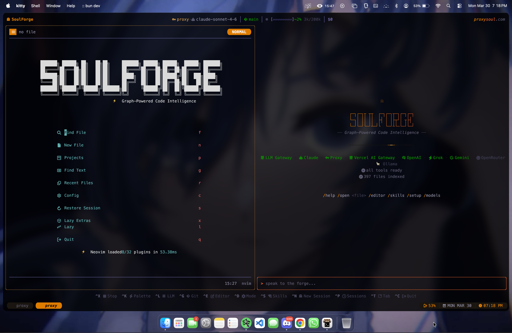
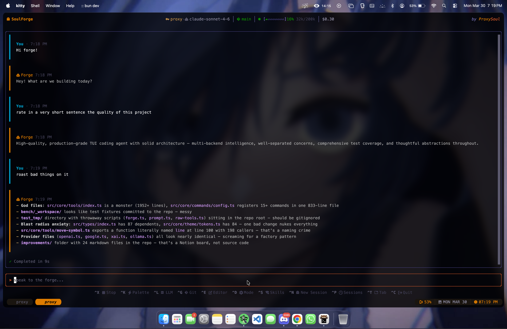

<div align="center">

<a href="https://paypal.me/waeru"></a>

<br/>

<picture>
  <source media="(prefers-color-scheme: dark)" srcset="assets/header-dark.svg" />
  <source media="(prefers-color-scheme: light)" srcset="assets/header-light.svg" />
  
</picture>

<a href="https://www.npmjs.com/package/@proxysoul/soulforge"><picture><source media="(prefers-color-scheme: dark)" srcset="https://img.shields.io/npm/v/@proxysoul/soulforge?label=version&color=7844f0&style=flat-square&labelColor=0a0818" /><source media="(prefers-color-scheme: light)" srcset="https://img.shields.io/npm/v/@proxysoul/soulforge?label=version&color=7844f0&style=flat-square" /></picture></a>&nbsp;
<a href="LICENSE"><picture><source media="(prefers-color-scheme: dark)" srcset="https://img.shields.io/badge/License-BSL%201.1-ff0059.svg?style=flat-square&labelColor=0a0818" /><source media="(prefers-color-scheme: light)" srcset="https://img.shields.io/badge/License-BSL%201.1-ff0059.svg?style=flat-square" /></picture></a>&nbsp;
<a href="https://github.com/ProxySoul/soulforge/actions/workflows/ci.yml"><picture><source media="(prefers-color-scheme: dark)" srcset="https://img.shields.io/github/actions/workflow/status/ProxySoul/soulforge/ci.yml?label=CI&style=flat-square&color=0b8b00&labelColor=0a0818" /><source media="(prefers-color-scheme: light)" srcset="https://img.shields.io/github/actions/workflow/status/ProxySoul/soulforge/ci.yml?label=CI&style=flat-square&color=0b8b00" /></picture></a>&nbsp;
<a href="https://github.com/ProxySoul/soulforge/actions/workflows/playground.yml"><picture><source media="(prefers-color-scheme: dark)" srcset="https://img.shields.io/github/actions/workflow/status/ProxySoul/soulforge/headless-forge.yml?label=Soul&style=flat-square&color=9b6af5&labelColor=0a0818" /><source media="(prefers-color-scheme: light)" srcset="https://img.shields.io/github/actions/workflow/status/ProxySoul/soulforge/headless-forge.yml?label=Soul&style=flat-square&color=9b6af5" /></picture></a>&nbsp;
<a href="https://www.typescriptlang.org/"><picture><source media="(prefers-color-scheme: dark)" srcset="https://img.shields.io/badge/TypeScript-strict-00a2ce.svg?style=flat-square&labelColor=0a0818" /><source media="(prefers-color-scheme: light)" srcset="https://img.shields.io/badge/TypeScript-strict-00a2ce.svg?style=flat-square" /></picture></a>&nbsp;
<a href="https://bun.sh"><picture><source media="(prefers-color-scheme: dark)" srcset="https://img.shields.io/badge/runtime-Bun-ff0059.svg?style=flat-square&labelColor=0a0818" /><source media="(prefers-color-scheme: light)" srcset="https://img.shields.io/badge/runtime-Bun-ff0059.svg?style=flat-square" /></picture></a>

<br/><br/>



<br/>


</div>


## Why SoulForge?

Every AI coding tool starts blind. It reads files, greps around, slowly builds a mental model of your codebase. You wait. You pay. The agent is doing orientation work, not real work.

SoulForge already knows. On startup it builds a **live dependency graph** of your entire codebase: every file, symbol, import, and export, ranked by PageRank importance, enriched with git co-change history, updated in real-time as files change. The agent knows which files matter, what depends on what, and how far an edit will ripple before it writes a single line. It's faster. It's more accurate. And it costs less.


### Faster, smarter, cheaper

<table>
<tr>
<td width="50%" valign="top">
<h4><a href="docs/repo-map.md">Live Soul Map</a></h4>
<p>SQLite-backed graph of every file, symbol, import, and export. PageRank ranking, git co-change history, blast radius scoring, clone detection, FTS5 search, unused export tracking. Updated in real-time. The agent never wastes a turn orienting itself.</p>
</td>
<td width="50%" valign="top">
<h4><a href="docs/architecture.md">Surgical reads</a></h4>
<p>Instead of reading entire files, the agent extracts exactly the function or class it needs by name. A 500-line file becomes a 20-line symbol extraction. Works across 33 languages via a 4-tier fallback chain: LSP, ts-morph, tree-sitter, regex.</p>
</td>
</tr>
<tr>
<td valign="top">
<h4><a href="docs/compaction.md">Instant compaction</a></h4>
<p>Working state is extracted incrementally as the conversation happens: files touched, decisions made, errors hit. When context gets long, compaction fires instantly from this pre-built state. Rich enough state skips the LLM entirely.</p>
</td>
<td valign="top">
<h4><a href="docs/agent-bus.md">Multi-agent dispatch</a></h4>
<p>Parallel explore, code, and web search agents. First read caches the file; others get a compact stub. Edit coordination prevents conflicts.</p>
</td>
</tr>
<tr>
<td valign="top">
<h4><a href="docs/cross-tab-coordination.md">Multi-tab</a></h4>
<p>Concurrent sessions, per-tab models and modes. Agents see cross-tab edits, get warnings on contested files, git ops coordinate automatically.</p>
</td>
<td valign="top">
<h4><a href="docs/compound-tools.md">Compound tools</a></h4>
<p><code>read</code> batches parallel + surgical. <code>multi_edit</code> atomic. <code>rename_symbol</code>, <code>move_symbol</code>, <code>rename_file</code> compiler-guaranteed cross-file. <code>project</code> auto-detects 25+ ecosystems.</p>
</td>
</tr>
<tr>
<td valign="top">
<h4>Mix-and-match models</h4>
<p>Opus on planning, Sonnet on coding, Haiku on cleanup. Or one model for everything. Task router gives full control.</p>
</td>
<td valign="top">
<h4>Prompt caching</h4>
<p>Soul Map is stable across turns, stays cached. On Anthropic the system prompt costs a fraction of normal.</p>
</td>
</tr>
</table>

<br/>

<details>
<summary><strong>More features</strong></summary>
<br/>

<table>
<tr>
<td width="180"><strong>Lock-in mode</strong></td>
<td>Hides narration, shows only tool activity and final answer. <code>/lock-in</code> or config.</td>
</tr>
<tr>
<td><strong>Embedded Neovim</strong></td>
<td>Your config, plugins, LSP servers. The AI works through the same editor you use. <a href="docs/architecture.md">More</a></td>
</tr>
<tr>
<td><strong>19 providers</strong></td>
<td>Anthropic, OpenAI, Google, xAI, Groq, DeepSeek, Mistral, Bedrock, Fireworks, MiniMax, Copilot, GitHub Models, Ollama, LM Studio, OpenRouter, LLM Gateway, Vercel AI Gateway, Proxy, any OpenAI-compatible.</td>
</tr>
<tr>
<td><strong>Task router</strong></td>
<td>Per-job model assignment. Spark agents and ember agents each get their own model. <a href="docs/architecture.md">More</a></td>
</tr>
<tr>
<td><strong>Code execution</strong></td>
<td>Sandboxed Python via Anthropic's <code>code_execution</code> tool. Process data, calculations, batch tool calls.</td>
</tr>
<tr>
<td><strong>User steering</strong></td>
<td>Type while the agent works. Messages queue and arrive at the next step. <a href="docs/steering.md">More</a></td>
</tr>
<tr>
<td><strong>Skills + gates</strong></td>
<td>Installable skills for domain work. Destructive actions need confirmation. Auto mode for full autonomy.</td>
</tr>
<tr>
<td><strong>Inline images</strong></td>
<td>Pixel-perfect images, animated GIFs, and video-to-GIF inline in chat via <code>soul_vision</code>. Kitty graphics protocol with Unicode placeholders. Supports local files, URLs, and code execution output. <a href="#inline-image-support">See terminal support</a></td>
</tr>
<tr>
<td><strong>4-tier intelligence</strong></td>
<td>LSP, ts-morph, tree-sitter, regex. 33 languages. Dual LSP: Neovim bridge when the editor is open, standalone servers when it's not. <a href="docs/architecture.md">More</a></td>
</tr>
</table>

</details>

<br/>

<div align="center">
  
</div>


### Inline image support

The `soul_vision` tool renders images and videos directly in chat. Pixel-perfect on supported terminals, high-quality terminal art everywhere else. Videos are converted to animated GIF via ffmpeg (two-pass palette encoding).

<table>
<thead>
<tr>
<th width="140">Terminal</th>
<th width="120">Static images</th>
<th width="120">Animated GIF</th>
<th width="120">Video to GIF</th>
<th>Method</th>
<th>Notes</th>
</tr>
</thead>
<tbody>
<tr>
<td><strong>Kitty</strong></td>
<td>Pixel-perfect</td>
<td>Animated</td>
<td>Animated</td>
<td>Kitty graphics protocol + Unicode placeholders</td>
<td>Full support, the gold standard</td>
</tr>
<tr>
<td><strong>Ghostty</strong></td>
<td>Pixel-perfect</td>
<td>Static frame</td>
<td>Static frame</td>
<td>Kitty graphics protocol + Unicode placeholders</td>
<td>Animation not yet implemented (<a href="https://github.com/ghostty-org/ghostty/discussions/5218">#5218</a>)</td>
</tr>
<tr>
<td><strong>Konsole</strong></td>
<td>chafa / half-block</td>
<td>Static frame</td>
<td>Static frame</td>
<td>Terminal art (chafa, built-in half-block)</td>
<td>Has Kitty graphics but no Unicode placeholders (<a href="https://invent.kde.org/utilities/konsole/-/merge_requests/594">MR #594</a>)</td>
</tr>
<tr>
<td><strong>iTerm2</strong></td>
<td>chafa / half-block</td>
<td>Static frame</td>
<td>Static frame</td>
<td>Terminal art (chafa, built-in half-block)</td>
<td>Has Kitty graphics but no Unicode placeholders (<a href="https://github.com/gnachman/iTerm2/commit/4fe5b21">commit</a>)</td>
</tr>
<tr>
<td><strong>WezTerm</strong></td>
<td>chafa / half-block</td>
<td>Static frame</td>
<td>Static frame</td>
<td>Terminal art (chafa, built-in half-block)</td>
<td>No Unicode placeholders (<a href="https://github.com/wezterm/wezterm/issues/986">#986</a>)</td>
</tr>
<tr>
<td><strong>Warp</strong></td>
<td>chafa / half-block</td>
<td>Static frame</td>
<td>Static frame</td>
<td>Terminal art (chafa, built-in half-block)</td>
<td>No Unicode placeholders (<a href="https://github.com/warpdotdev/Warp/issues/6210">#6210</a>)</td>
</tr>
<tr>
<td><strong>Alacritty</strong></td>
<td>chafa / half-block</td>
<td>Static frame</td>
<td>Static frame</td>
<td>Terminal art (chafa, built-in half-block)</td>
<td>No graphics protocol</td>
</tr>
<tr>
<td><strong>Others</strong></td>
<td>Half-block art</td>
<td>Static frame</td>
<td>Static frame</td>
<td>Built-in half-block ANSI art</td>
<td>Any truecolor terminal works</td>
</tr>
</tbody>
</table>

<sub>

**Formats:** PNG, JPG, WebP, GIF, BMP, TIFF, MP4, MKV, WebM, AVI, MOV. Non-PNG images auto-converted via `ffmpeg`, `sips` (macOS), or ImageMagick. Videos converted to GIF with two-pass palette encoding (fps capped, scaled to 320px width).
Install [`chafa`](https://github.com/hpjansson/chafa) for higher quality terminal art on non-pixel terminals. Install [`ffmpeg`](https://github.com/FFmpeg/FFmpeg) for animated GIF, video conversion, and format support. Install [`yt-dlp`](https://github.com/yt-dlp/yt-dlp) to display videos from URLs.

```bash
brew install ffmpeg chafa yt-dlp
```

</sub>

## How it compares

<table>
<thead>
<tr>
<th width="160"></th>
<th>SoulForge</th>
<th>Claude Code</th>
<th>Copilot CLI</th>
<th>Codex CLI</th>
<th>Aider</th>
</tr>
</thead>
<tbody>
<tr>
<td><strong>Codebase awareness</strong></td>
<td>Live SQLite graph: PageRank, blast radius, cochange, clone detection, FTS5, unused exports</td>
<td>File reads + grep</td>
<td>None</td>
<td>MCP plugins</td>
<td>Tree-sitter + PageRank</td>
</tr>
<tr>
<td><strong>Cost optimization</strong></td>
<td>Soul Map + surgical reads + instant compaction + shared agent cache + model mixing + prompt caching</td>
<td>Auto-compaction</td>
<td>Context window mgmt</td>
<td>Server-side compaction</td>
<td>-</td>
</tr>
<tr>
<td><strong>Code intelligence</strong></td>
<td>4-tier: LSP / ts-morph / tree-sitter / regex. Dual LSP. 33 langs</td>
<td>LSP via plugins</td>
<td>LSP (VS Code)</td>
<td>MCP-based LSP</td>
<td>Tree-sitter AST</td>
</tr>
<tr>
<td><strong>Multi-agent</strong></td>
<td>Parallel dispatch, shared file/tool cache, edit coordination</td>
<td>Subagents + Teams</td>
<td>Subagents + Fleet</td>
<td>Multi-agent v2</td>
<td>Single</td>
</tr>
<tr>
<td><strong>Multi-tab</strong></td>
<td>Per-tab models, file claims, cross-tab git coordination</td>
<td>-</td>
<td>-</td>
<td>-</td>
<td>-</td>
</tr>
<tr>
<td><strong>Task routing</strong></td>
<td>Per-task model (spark, ember, web search, verify, desloppify, compact)</td>
<td>Single model</td>
<td>Single model</td>
<td>Per-agent model</td>
<td>Single model</td>
</tr>
<tr>
<td><strong>Compound tools</strong></td>
<td><code>read</code> batch+surgical, <code>multi_edit</code> atomic, <code>rename_symbol</code>, <code>move_symbol</code>, <code>refactor</code>, <code>project</code></td>
<td>Rename via LSP</td>
<td>-</td>
<td>-</td>
<td>-</td>
</tr>
<tr>
<td><strong>Editor</strong></td>
<td>Embedded Neovim (your config, your plugins)</td>
<td>No</td>
<td>No</td>
<td>No</td>
<td>No</td>
</tr>
<tr>
<td><strong>Providers</strong></td>
<td>19 + custom OpenAI-compatible</td>
<td>Anthropic only</td>
<td>Multi-model</td>
<td>OpenAI only</td>
<td>100+ LLMs</td>
</tr>
<tr>
<td><strong>License</strong></td>
<td>BSL 1.1</td>
<td>Proprietary</td>
<td>Proprietary</td>
<td>Apache 2.0</td>
<td>Apache 2.0</td>
</tr>
</tbody>
</table>

<sub>Verified March 29, 2026. <a href="https://github.com/ProxySoul/soulforge/issues">Report inaccuracies.</a></sub>


## Installation

macOS and Linux. First launch checks for prerequisites and offers to install Neovim and Nerd Fonts.

### Homebrew (recommended)

```bash
brew tap proxysoul/tap
brew install soulforge
```

<details>
<summary><strong>Bun (global)</strong></summary>
<br/>

```bash
curl -fsSL https://bun.sh/install | bash
bun install -g @proxysoul/soulforge
soulforge
```

</details>

<details>
<summary><strong>Prebuilt binary</strong></summary>
<br/>

Download from [Releases](https://github.com/ProxySoul/soulforge/releases/latest):

```bash
tar xzf soulforge-*.tar.gz && cd soulforge-*/ && ./install.sh
```

Installs to `~/.soulforge/`, adds to PATH.

</details>

<details>
<summary><strong>Self-contained bundle</strong></summary>
<br/>

Ships Neovim 0.11, ripgrep, fd, lazygit, tree-sitter grammars, Nerd Font symbols. Zero system deps.

```bash
git clone https://github.com/ProxySoul/soulforge.git && cd soulforge && bun install
./scripts/bundle.sh              # macOS ARM64
./scripts/bundle.sh x64          # Intel Mac
./scripts/bundle.sh x64 linux    # Linux x64
./scripts/bundle.sh x64-baseline linux  # Linux x64 (older CPUs)
./scripts/bundle.sh arm64 linux  # Linux ARM64
cd dist/bundle/soulforge-*/ && ./install.sh
```

</details>

<details>
<summary><strong>Build from source</strong></summary>
<br/>

Requires [Bun](https://bun.sh) >= 1.0 and [Neovim](https://neovim.io) >= 0.11.

```bash
git clone https://github.com/ProxySoul/soulforge.git && cd soulforge && bun install
bun run dev          # development mode
# or
bun run build && bun link && soulforge
```

</details>

### Quick start

```bash
soulforge                                  # launch, pick a model with Ctrl+L
soulforge --set-key anthropic sk-ant-...   # save a key
soulforge --headless "your prompt here"    # non-interactive
```

See [GETTING_STARTED.md](GETTING_STARTED.md) for a full walkthrough.


## Usage

```bash
soulforge                                    # TUI
soulforge --headless "prompt"               # stream to stdout
soulforge --headless --json "prompt"        # structured JSON
soulforge --headless --chat                 # multi-turn
soulforge --headless --model provider/model # override model
soulforge --headless --mode architect       # read-only
soulforge --headless --diff "fix the bug"   # show changed files
```

<table>
<thead><tr><th width="140">Mode</th><th>What it does</th></tr></thead>
<tbody>
<tr><td><code>default</code></td><td>Full agent, all tools</td></tr>
<tr><td><code>auto</code></td><td>Executes immediately, no questions</td></tr>
<tr><td><code>architect</code></td><td>Read-only analysis and review</td></tr>
<tr><td><code>socratic</code></td><td>Guided learning through questions</td></tr>
<tr><td><code>challenge</code></td><td>Pushes back on assumptions</td></tr>
<tr><td><code>plan</code></td><td>Planning only, no code changes</td></tr>
</tbody>
</table>

[Full CLI reference](docs/headless.md)


## Providers

<table>
<thead><tr><th width="200">Provider</th><th>Setup</th></tr></thead>
<tbody>
<tr><td><a href="https://llmgateway.io/?ref=6tjJR2H3X4E9RmVQiQwK"><strong>LLM Gateway</strong></a></td><td><code>LLM_GATEWAY_API_KEY</code></td></tr>
<tr><td><a href="https://console.anthropic.com/"><strong>Anthropic</strong></a></td><td><code>ANTHROPIC_API_KEY</code></td></tr>
<tr><td><a href="https://platform.openai.com/"><strong>OpenAI</strong></a></td><td><code>OPENAI_API_KEY</code></td></tr>
<tr><td><a href="https://aistudio.google.com/"><strong>Google</strong></a></td><td><code>GOOGLE_GENERATIVE_AI_API_KEY</code></td></tr>
<tr><td><a href="https://console.x.ai/"><strong>xAI</strong></a></td><td><code>XAI_API_KEY</code></td></tr>
<tr><td><a href="https://console.groq.com/"><strong>Groq</strong></a></td><td><code>GROQ_API_KEY</code></td></tr>
<tr><td><a href="https://platform.deepseek.com/"><strong>DeepSeek</strong></a></td><td><code>DEEPSEEK_API_KEY</code></td></tr>
<tr><td><a href="https://console.mistral.ai/"><strong>Mistral</strong></a></td><td><code>MISTRAL_API_KEY</code></td></tr>
<tr><td><a href="https://aws.amazon.com/bedrock/"><strong>Amazon Bedrock</strong></a></td><td><code>AWS_ACCESS_KEY_ID</code> + <code>AWS_SECRET_ACCESS_KEY</code> + <code>AWS_REGION</code></td></tr>
<tr><td><a href="https://fireworks.ai/"><strong>Fireworks</strong></a></td><td><code>FIREWORKS_API_KEY</code></td></tr>
<tr><td><a href="https://platform.minimaxi.com/"><strong>MiniMax</strong></a></td><td><code>MINIMAX_API_KEY</code></td></tr>
<tr><td><a href="https://github.com/features/copilot"><strong>GitHub Copilot</strong></a></td><td>OAuth token from IDE (<a href="docs/copilot-provider.md">setup</a>)</td></tr>
<tr><td><a href="https://github.com/marketplace/models"><strong>GitHub Models</strong></a></td><td><code>GITHUB_MODELS_API_KEY</code> (PAT with <code>models:read</code>)</td></tr>
<tr><td><a href="https://ollama.ai"><strong>Ollama</strong></a></td><td>Auto-detected</td></tr>
<tr><td><a href="https://lmstudio.ai"><strong>LM Studio</strong></a></td><td>Auto-detected</td></tr>
<tr><td><a href="https://openrouter.ai"><strong>OpenRouter</strong></a></td><td><code>OPENROUTER_API_KEY</code></td></tr>
<tr><td><a href="https://vercel.com/ai-gateway"><strong>Vercel AI Gateway</strong></a></td><td><code>AI_GATEWAY_API_KEY</code></td></tr>
<tr><td><a href="https://github.com/router-for-me/CLIProxyAPI"><strong>Proxy</strong></a></td><td><code>PROXY_API_KEY</code></td></tr>
<tr><td><strong>Custom</strong></td><td>Any OpenAI-compatible API</td></tr>
</tbody>
</table>

<details>
<summary><strong>Provider notes</strong></summary>
<br/>

**Amazon Bedrock** uses AWS IAM credentials. Set `AWS_ACCESS_KEY_ID`, `AWS_SECRET_ACCESS_KEY`, `AWS_REGION` (defaults `us-east-1`). Supports `AWS_SESSION_TOKEN` for temporary creds.

**GitHub Copilot**: sign in via IDE, copy `oauth_token` from `~/.config/github-copilot/apps.json`, save with `/keys` or `--set-key copilot`. [Full guide](docs/copilot-provider.md).

**GitHub Models**: free playground API, per-token billing. Fine-grained PAT with `models:read`. Lower rate limits than Copilot.

**Ollama**: auto-detected at `localhost:11434`. Override with `OLLAMA_HOST`.

**LM Studio**: auto-detected at `localhost:1234`. Override with `LM_STUDIO_URL`. Optional auth via `LM_API_TOKEN`.

</details>

Custom providers via config:

```json
{
  "providers": [{
    "id": "my-provider",
    "name": "My Provider",
    "baseURL": "https://api.example.com/v1",
    "envVar": "MY_PROVIDER_API_KEY",
    "models": ["model-a", "model-b"]
  }]
}
```

[Custom providers](docs/headless.md#custom-providers) / [Provider options](docs/provider-options.md)


## Configuration

Layered: global (`~/.soulforge/config.json`) + project (`.soulforge/config.json`).

```json
{
  "defaultModel": "anthropic/claude-sonnet-4-6",
  "thinking": { "mode": "adaptive" },
  "repoMap": true,
  "taskRouter": {
    "spark": "anthropic/claude-sonnet-4-6",
    "ember": "anthropic/claude-opus-4-6",
    "webSearch": "anthropic/claude-haiku-4-5",
    "desloppify": "anthropic/claude-haiku-4-5",
    "compact": "google/gemini-2.0-flash"
  },
  "instructionFiles": ["soulforge", "claude", "cursorrules"]
}
```

Drop a `SOULFORGE.md` in your project root for conventions, architecture notes, preferences. Also reads `CLAUDE.md`, `.cursorrules`, `AGENTS.md`. Toggle via `/instructions`.

See [GETTING_STARTED.md](GETTING_STARTED.md) for the full config reference.


## Documentation

<table>
<thead><tr><th width="240">Topic</th><th>Description</th></tr></thead>
<tbody>
<tr><td colspan="2"><strong>Core</strong></td></tr>
<tr><td><a href="docs/architecture.md">Architecture</a></td><td>System overview, intelligence router, agent system, tool design</td></tr>
<tr><td><a href="docs/repo-map.md">Repo Map</a></td><td>PageRank, cochange, blast radius, clone detection, language support</td></tr>
<tr><td><a href="docs/agent-bus.md">Agent Bus</a></td><td>Multi-agent coordination, shared cache, edit ownership</td></tr>
<tr><td><a href="docs/compaction.md">Compaction</a></td><td>Context management, working state extraction</td></tr>
<tr><td colspan="2"><strong>Tools</strong></td></tr>
<tr><td><a href="docs/compound-tools.md">Compound Tools</a></td><td>read, multi_edit, rename_symbol, move_symbol, refactor, project</td></tr>
<tr><td><a href="docs/project-tool.md">Project Tool</a></td><td>25+ ecosystems, pre-commit checks, monorepo discovery</td></tr>
<tr><td><a href="docs/commands-reference.md">Commands</a></td><td>All 86 slash commands</td></tr>
<tr><td colspan="2"><strong>Usage</strong></td></tr>
<tr><td><a href="docs/headless.md">Headless Mode</a></td><td>CLI flags, JSON/JSONL output, CI/CD integration</td></tr>
<tr><td><a href="docs/steering.md">Steering</a></td><td>Mid-stream user input</td></tr>
<tr><td><a href="docs/cross-tab-coordination.md">Cross-Tab Coordination</a></td><td>Multi-tab file claims, git coordination</td></tr>
<tr><td colspan="2"><strong>Config</strong></td></tr>
<tr><td><a href="docs/provider-options.md">Provider Options</a></td><td>Thinking modes, context management</td></tr>
<tr><td><a href="docs/themes.md">Themes</a></td><td>24 themes, custom themes, hot reload</td></tr>
<tr><td><a href="docs/prompt-system.md">Prompt System</a></td><td>Per-family prompts, mode overlays</td></tr>
<tr><td><a href="docs/copilot-provider.md">Copilot Provider</a></td><td>Setup, legal review</td></tr>
<tr><td colspan="2"><strong>Start</strong></td></tr>
<tr><td><a href="GETTING_STARTED.md">Getting Started</a></td><td>First launch walkthrough</td></tr>
<tr><td><a href="CONTRIBUTING.md">Contributing</a></td><td>Dev setup, PR guidelines</td></tr>
</tbody>
</table>


## Roadmap

Extracting the intelligence layer into reusable packages:

- **`@soulforge/intelligence`** : graph intelligence, tools, agent orchestration as a library
- **`@soulforge/mcp`** : Soul Map tools as MCP servers for Claude Code, Cursor, Copilot, any MCP client
- **`sf --headless`** : shipped. [Docs](docs/headless.md)

<table>
<thead><tr><th width="120">Status</th><th>Item</th></tr></thead>
<tbody>
<tr><td><strong>In progress</strong></td><td>MCP support, repo map visualization, GitHub CLI integration, dispatch worktrees, <a href="https://agentclientprotocol.com/">ACP</a></td></tr>
<tr><td><strong>Planned</strong></td><td>Monorepo graph support, benchmarks, orchestrated workflows (planner &gt; TDD &gt; reviewer &gt; security)</td></tr>
</tbody>
</table>


## Inspirations

- **[Aider](https://github.com/Aider-AI/aider)** : tree-sitter repo maps with PageRank. SoulForge adds cochange, blast radius, clone detection, live updates.
- **[Everything Claude Code](https://github.com/affaan-m/everything-claude-code)** : enforce behavior with code, not prompts.
- **[Vercel AI SDK](https://sdk.vercel.ai)** : multi-provider abstraction.
- **[Neovim](https://neovim.io)** : embedded via msgpack-RPC. Your config and muscle memory intact.


## License

[Business Source License 1.1](LICENSE). Free for personal and internal use. Commercial use requires a [commercial license](COMMERCIAL_LICENSE.md). Converts to Apache 2.0 on March 15, 2030.

<br/>

<div align="center">
<sub>Built by <a href="https://github.com/proxysoul">proxySoul</a></sub>
</div>
