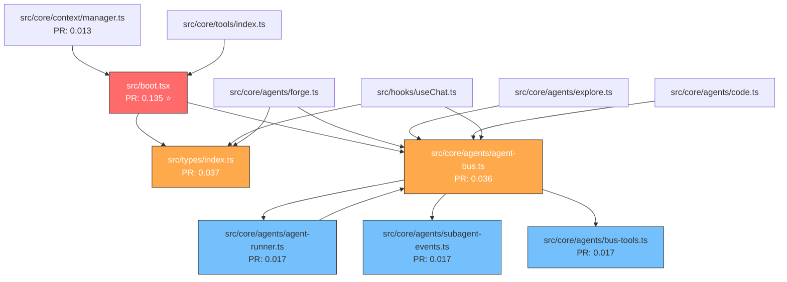
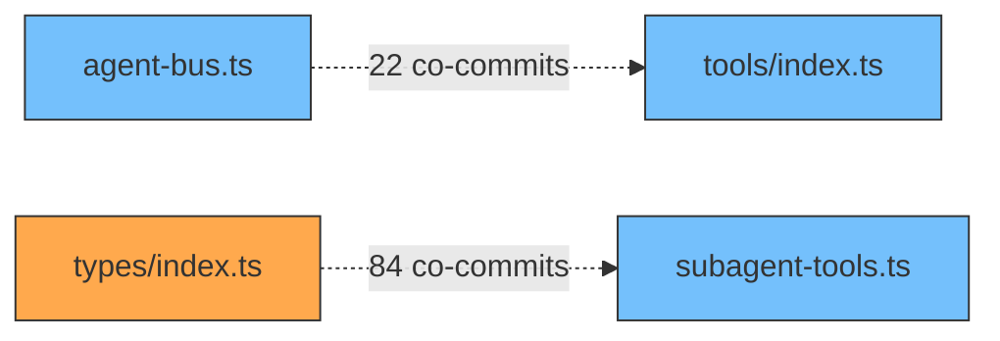

# How the AI Sees Your Codebase — A Visual Guide

> This document shows **exactly** what Forge's "Soul Map" looks like from the AI's perspective,
> using real data from this repository. If you want the technical deep-dive, see [repo-map.md](./repo-map.md).

---

## 1. The Raw View — What Lands in the AI's Context Window

Every turn, the AI receives a **ranked, budget-fitted snapshot** of the codebase.
Here's a trimmed real example of what Forge sees for this repo:

```
Soul Map (194 files, 3042 symbols, 1951 edges)

src/boot.tsx                                     394L  68sym  PR:0.135
  +createStore — Global Zustand store for all runtime state
  +storeRef — Stable ref for non-React access
  +defaultModels — Default model configuration per provider
   ModelOverrides
   StoreState

src/core/agents/agent-bus.ts                     858L 101sym  PR:0.036  [R:15]
  +AgentBus — Shared coordination bus for parallel subagent communication
  +acquireFileRead — Lock-free file read with cache and waiter pattern
  +SharedCache — Pre-seeded cache for warm agent starts
  +AgentTask +AgentResult +AgentRole +ReturnFormat
   FileCacheEntry

src/types/index.ts                               299L  35sym  PR:0.037  [R:83]
  +ChatMessage +ToolCall +ToolResult
  +Plan +PlanOutput +PlanStepStatus
  +InteractiveCallbacks +PendingQuestion
   MessageSegment NvimConfigMode

src/core/intelligence/types.ts                   427L  27sym  PR:0.046
  +RepoMap — Core repo map class
  +SoulMapTools — Tool interface for soul_grep, soul_find, etc.
  +FileNode +SymbolNode +EdgeRecord
   PageRankOptions
```

### Reading the notation

| Element | Meaning |
|---------|---------|
| `394L` | 394 lines of code |
| `68sym` | 68 symbols extracted by tree-sitter AST parsing |
| `PR:0.135` | **PageRank score** — how structurally important this file is (higher = more files depend on it) |
| `[R:15]` | **Blast radius** — 15 other files directly import from this file |
| `+Symbol` | Exported (public) symbol |
| ` Symbol` | Internal (private) symbol |
| `— description` | LLM-generated semantic summary, cached per symbol |

---

## 2. The Dependency Graph

The Soul Map builds a **directed graph** from import statements. Here's a real subgraph of this repo's agent system:



**Color key:** 🔴 Highest PageRank · 🟠 High PageRank · 🔵 Medium PageRank

### How PageRank works here

PageRank treats imports like "votes." `src/boot.tsx` has the highest score (0.135) because **30 files import from it** — it's the gravity center. `src/types/index.ts` has a blast radius of 83 (most files reference its types), but a lower PageRank because many of those references are leaf files that don't themselves get imported.

```
PageRank intuition:
  It's not just "who has the most imports"
  It's "who is imported by files that are themselves important"

  boot.tsx → imported by agent-bus → imported by agent-runner → imported by forge
  ^^^^^^^^                           ^^^^^^^^^^^^^^^^^^^^^^^^^^^
  Score compounds through chains of important dependents
```

---

## 3. Co-Change Analysis — The Hidden Coupling

The import graph shows **structural** coupling. But some files are always edited together
even without imports — **behavioral** coupling. The Soul Map mines `git log` to find these:

```
Co-change detection (last 300 commits, 2-20 files per commit):

  agent-bus.ts ←→ tools/index.ts          22 co-commits  ████████████████████░░  strong
  types/index.ts ←→ subagent-tools.ts     84 co-commits  ████████████████████████ very strong
  agent-runner.ts ←→ agent-bus.ts          (direct import — already in graph)
```



**Dashed lines = co-change (no import, but always edited together)**

> Why this matters: When the AI edits `agent-bus.ts`, the Soul Map automatically
> boosts `tools/index.ts` in the next ranking — because history says they change together.

---

## 4. AST Extraction — What Tree-Sitter Sees

For every source file, tree-sitter parses the AST and extracts symbols:

```
File: src/core/agents/agent-bus.ts (858 lines)
Language: typescript
Parse time: ~12ms

AST extraction results:
┌─────────────────────────┬───────────┬──────────┬──────┐
│ Symbol                  │ Kind      │ Exported │ Line │
├─────────────────────────┼───────────┼──────────┼──────┤
│ normalizePath           │ function  │ ✓        │  15  │
│ SharedCache             │ interface │ ✓        │  28  │
│ BusFinding              │ interface │ ✓        │  42  │
│ AgentRole               │ type      │ ✓        │  55  │
│ ReturnFormat            │ type      │ ✓        │  56  │
│ AgentTask               │ interface │ ✓        │  60  │
│ AgentResult             │ interface │ ✓        │  85  │
│ DependencyFailedError   │ class     │ ✓        │ 102  │
│ FileReadRecord          │ interface │ ✓        │ 110  │
│ AgentBus                │ class     │ ✓        │ 125  │
│ ...91 more internal     │           │          │      │
└─────────────────────────┴───────────┴──────────┴──────┘

Identifier references extracted (used for edge building):
  → agent-runner (import)
  → subagent-events (import)
  → bus-tools (import)
  → ErrorStore (cross-file reference)
```

The AI sees the **signatures**, not the implementations:

```typescript
// What tree-sitter extracts (and the AI sees):
export function normalizePath(p: string): string
export class AgentBus {
  constructor(tasks, sharedCache, projectRoot, ...)
  async run(): Promise<AgentResult[]>
  async acquireFileRead(agentId, absPath, reader): Promise<string>
}

// What tree-sitter does NOT put in the map:
// The 700+ lines of implementation code inside AgentBus
// → The AI only reads those when it needs to edit the file
```

---

## 5. Ranking in Action — A Real Turn

When you ask "fix the dispatch validation," here's what happens:

```
Step 1: Conversation terms extracted
  → ["dispatch", "validation"]

Step 2: FTS5 search on symbols table
  → Match: dispatch (in subagent-tools.ts, line 45)
  → Match: validateDispatch (in agent-bus.ts, line 230)

Step 3: PageRank with personalized restart vector
  Base PageRank:     boot.tsx=0.135  agent-bus.ts=0.036  types/index.ts=0.037
  After FTS boost:   boot.tsx=0.135  agent-bus.ts=0.536  subagent-tools.ts=0.520
                                     ↑ +0.5 FTS match    ↑ +0.5 FTS match

Step 4: If you previously edited agent-bus.ts
  Edited file boost: agent-bus.ts gets 5× weight in restart vector
  Neighbor boost:    agent-runner.ts gets +1.0 (direct import neighbor)
  Co-change boost:   tools/index.ts gets +min(22/5, 3.0) = +3.0

Step 5: Final ranking (top of map)
  1. agent-bus.ts        — FTS match + edit boost + high base PR
  2. subagent-tools.ts   — FTS match + co-change boost
  3. tools/index.ts      — co-change partner (22 co-commits)
  4. agent-runner.ts     — graph neighbor of edited file
  5. boot.tsx            — always high (structural gravity)
```

```
Before your question:                After your question:
┌──────────────────────┐            ┌──────────────────────┐
│ 1. boot.tsx     0.135│            │ 1. agent-bus.ts 0.536│ ← jumps to #1
│ 2. intel/types  0.046│            │ 2. subagent-tools.ts │ ← jumps to #2
│ 3. types/index  0.037│            │ 3. tools/index.ts    │ ← co-change boost
│ 4. install.ts   0.036│            │ 4. agent-runner.ts   │ ← neighbor boost
│ 5. agent-bus.ts 0.036│            │ 5. boot.tsx     0.135│
│ ...                  │            │ ...                  │
└──────────────────────┘            └──────────────────────┘
          Static ranking                Context-aware ranking
```

---

## 6. Blast Radius — Impact Analysis

When the AI considers editing a file, it checks the blast radius:

```
src/types/index.ts — Blast Radius Analysis
═══════════════════════════════════════════

Direct dependents:           83 files import from this
Co-change partners:           1 file changes with this
Total affected scope:        31 files (transitive)

Exported symbols at risk:
  ├── interface ChatMessage      → used in 12 files
  ├── interface ToolResult       → used in 8 files
  ├── interface Plan             → used in 6 files
  ├── type PlanStepStatus        → used in 4 files
  └── interface InteractiveCallbacks → used in 3 files

Risk assessment:
  ⚠️  HIGH IMPACT — changing an interface here could break 83 files
  💡  AI will prefer additive changes (new optional fields)
      over breaking changes (renamed/removed fields)
```

```
                    ┌─────────────┐
              ┌────▶│ useChat.ts  │
              │     └─────────────┘
              │     ┌─────────────┐
              ├────▶│ MessageList │
              │     └─────────────┘
              │     ┌─────────────┐
              ├────▶│ forge.ts    │
┌────────────┐│     └─────────────┘
│types/index ├┤     ┌─────────────┐
│ [R:83] ⚠️  ├┼────▶│ manager.ts  │
└────────────┘│     └─────────────┘
              │     ┌─────────────┐
              ├────▶│ App.tsx     │
              │     └─────────────┘
              │         ...
              └────▶ 78 more files
```

---

## 7. Budget Dynamics — Shrinking the Map

The Soul Map adapts its size based on how far into the conversation you are:

```
Token budget formula:
  budget = 1500 + (2500 - 1500) × max(0, 1 - conversationTokens / 100,000)

                    Budget
  Start of chat:    2,500 tokens  ████████████████████████████████████
  ~25K tokens in:   2,250 tokens  ██████████████████████████████████
  ~50K tokens in:   2,000 tokens  ████████████████████████████████
  ~75K tokens in:   1,750 tokens  ██████████████████████████████
  ~100K+ tokens:    1,500 tokens  ████████████████████████████

  Why? Early on, the AI needs orientation (more map).
  Later, context is established (save tokens for code).
```

**Binary search fitting:** The renderer tries to fit as many file blocks as possible
within the budget. It starts with all 194 files, binary-searches for the cutoff
where the rendered text fits within the token limit, and drops the lowest-ranked
files first.

```
194 files in graph
 │
 ▼ Binary search: can we fit 194? No (would be ~8000 tokens)
 ▼ Binary search: can we fit 97?  No (would be ~4000 tokens)
 ▼ Binary search: can we fit 48?  Yes (fits in ~2200 tokens)
 ▼ Binary search: can we fit 72?  No
 ▼ Binary search: can we fit 60?  Yes (~2450 tokens)
 ▼ Binary search: can we fit 66?  No
 ▼ Binary search: can we fit 63?  Yes (~2500 tokens) ← winner
 │
 ▼ Render top 63 files with their symbols
```

---

## 8. Real-Time Updates — The Edit Loop

```
You ask: "rename AgentBus to TaskBus"
          │
          ▼
┌─────────────────────┐
│  AI edits the file   │
│  edit_file(...)      │
└─────────┬───────────┘
          │
          ▼
┌─────────────────────┐
│ emitFileEdited()    │──▶ File marked dirty
└─────────┬───────────┘
          │
          ▼ (500ms debounce)
┌─────────────────────┐
│ Re-index with        │──▶ tree-sitter re-parses
│ tree-sitter          │    New symbol: TaskBus (was AgentBus)
└─────────┬───────────┘
          │
          ▼
┌─────────────────────┐
│ Recompute edges      │──▶ Import graph updated
│ Recompute PageRank   │    New scores calculated
└─────────┬───────────┘
          │
          ▼
┌─────────────────────┐
│ Clear render cache   │──▶ Next turn gets fresh map
│ Invalidate summaries │    LLM re-summarizes TaskBus
└─────────────────────┘
          │
          ▼
   Next AI turn sees:
   agent-bus.ts [R:15]
     +TaskBus — Shared coordination bus for parallel subagent communication
     (summary regenerated because mtime changed)
```

---

## 9. The Full Picture

```
┌──────────────────────────────────────────────────────────────┐
│                    YOUR CODEBASE                              │
│  194 files · 3,042 symbols · 1,951 import edges              │
└──────────────────────┬───────────────────────────────────────┘
                       │
            ┌──────────┴──────────┐
            ▼                     ▼
   ┌─────────────────┐   ┌──────────────────┐
   │  tree-sitter     │   │   git log         │
   │  AST parsing     │   │   (300 commits)   │
   │                  │   │                   │
   │  Extract:        │   │  Extract:         │
   │  • symbols       │   │  • co-changes     │
   │  • signatures    │   │  • file pairs     │
   │  • imports       │   │  • change freq    │
   │  • identifiers   │   │                   │
   └────────┬─────────┘   └────────┬──────────┘
            │                      │
            ▼                      ▼
   ┌────────────────────────────────────────┐
   │          SQLite Database                │
   │                                        │
   │  files ──── symbols ──── edges         │
   │    │          │                         │
   │    │     symbols_fts (FTS5)            │
   │    │                                    │
   │    └──── cochanges                     │
   │          semantic_summaries             │
   └──────────────────┬────────────────────┘
                      │
         ┌────────────┴────────────┐
         ▼                         ▼
┌─────────────────┐      ┌──────────────────┐
│ PageRank (20    │      │ LLM Summaries    │
│ iterations,     │      │                  │
│ α = 0.85)       │      │ "One-line desc   │
│                 │      │  of what this    │
│ + Personalized  │      │  symbol does"    │
│   restart vector│      │                  │
│   (edits: 5×,   │      │ Cached by mtime  │
│    reads: 3×,   │      │ in SQLite        │
│    editor: 2×)  │      │                  │
└────────┬────────┘      └────────┬─────────┘
         │                        │
         ▼                        ▼
┌──────────────────────────────────────────┐
│         Ranked Render Pipeline            │
│                                          │
│  1. Compute personalized PageRank        │
│  2. Apply post-hoc boosts (FTS, co-chg)  │
│  3. Calculate token budget               │
│  4. Binary search for file cutoff        │
│  5. Render top-N files with symbols      │
│  6. Attach summaries to top symbols      │
└──────────────────┬───────────────────────┘
                   │
                   ▼
        ┌─────────────────────┐
        │   AI Context Window  │
        │                     │
        │   "Soul Map (194    │
        │    files, 3042      │
        │    symbols...)"     │
        │                     │
        │   boot.tsx  PR:0.135│
        │     +createStore    │
        │     +storeRef       │
        │   ...               │
        └─────────────────────┘
```

---

## 10. Tool Tiers — How the AI Decides What to Read

The Soul Map enables a **read-as-little-as-possible** strategy:

```
Question: "Where is AgentBus defined?"

  Tier 0 — Check Soul Map (already in context)         Cost: 0 tokens
  ✅ Answer: src/core/agents/agent-bus.ts, line 125
  DONE. No tool call needed.

Question: "What calls acquireFileRead?"

  Tier 0 — Soul Map shows it exists in agent-bus.ts     Cost: 0 tokens
  Tier 1 — navigate(call_hierarchy)                     Cost: ~200 tokens
  ✅ Answer: called from agent-runner.ts:340, explore.ts:89
  DONE. Never read the full files.

Question: "Fix the bug in acquireFileRead"

  Tier 0 — Soul Map locates it                          Cost: 0 tokens
  Tier 1 — navigate(definition) → line 125              Cost: ~100 tokens
  Tier 2 — read_file(target: function, name:            Cost: ~400 tokens
            acquireFileRead) → reads just that function
  Edit: multi_edit with fix                              Cost: ~200 tokens
  DONE. Read 1 function, not the 858-line file.
```

```
Token efficiency comparison:

  Without Soul Map:                    With Soul Map:
  ┌──────────────────────────┐        ┌──────────────────────────┐
  │ read entire project tree │ 2000   │ Soul Map in context      │ 2500
  │ read agent-bus.ts        │ 3400   │ read acquireFileRead()   │  400
  │ read agent-runner.ts     │ 2900   │ edit with fix            │  200
  │ read types/index.ts      │ 1200   │                          │
  │ grep for related files   │  800   │                          │
  │ read 3 more files        │ 4200   │                          │
  │ finally: edit with fix   │  200   │                          │
  ├──────────────────────────┤        ├──────────────────────────┤
  │ Total: ~14,700 tokens    │        │ Total: ~3,100 tokens     │
  └──────────────────────────┘        └──────────────────────────┘
                                        ~79% fewer tokens
```

---

*Generated from the live Soul Map of `@proxysoul/soulforge` — the same data structure
the AI uses on every turn to understand this codebase.*
